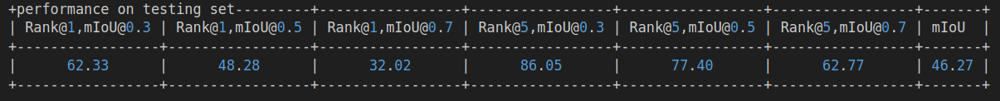

# CCL_ACB_VIDEO_MOMENT_RETRIEVAL
Retrieve the moments(start and end timestamps) from the videos given sentence query. The paper is accepted in 2024 IEEE/CVF Winter Conference on Applications of Computer Vision Workshops (WACVW).
We appreciate the contribution of the following [code](https://github.com/mxingzhang90/MSAT).
The checkpoint for both datasets can be downloaded from the following [drive](https://drive.google.com/drive/folders/1WyxH4S46AKEJnOln7DxRys0QVURoVc5O?usp=sharing).

## Model architecture


## Training
Use the following commands for training:
```
# For ActivityNet Captions
python moment_localization/train.py --cfg experiments/activitynet/MSAT-32.yaml --verbose

# For TACoS
python moment_localization/train.py --cfg experiments/tacos/MSAT-128.yaml --verbose
```
## Testing
Use the following commands for testing and replication of results:
```
# For ActivityNet Captions
python moment_localization/test.py --cfg experiments/activitynet/MSAT-32.yaml --verbose --split test

# For TACoS
python moment_localization/test.py --cfg experiments/tacos/MSAT-128.yaml --verbose --split test
```

## Inference
Use the following commands for inference:
```
# For ActivityNet Captions
python moment_localization/inference_activitynet.py --cfg experiments/activitynet/MSAT-32.yaml --verbose

# For TACoS
python moment_localization/inference_tacos.py --cfg experiments/tacos/MSAT-128.yaml --verbose

```
## Demo


## Note:
The testing results is found to be better for acivitynet captions compared to what is mentioned on the original paper. Likewise, We also updated the checkpoints for TACOS datasets.

#### TACOS


#### ACTIVITYNET


## Contact Information
Please feel free to contact me if any help needed

Email: *075bei016.love@pcampus.edu.np*


